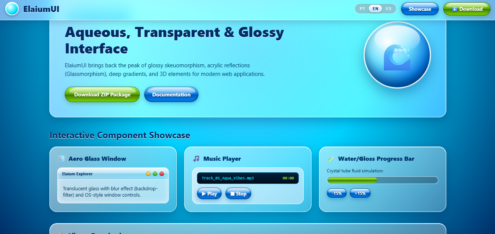
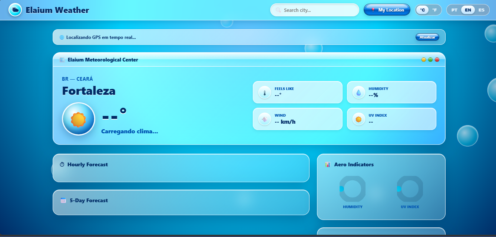

# 🌊 ElaiumUI — Frutiger Aero Web Framework
> *Bring back the vibrant, glossy, glassmorphic, and organic era of the 2000s web.*


---
✨ Overview
ElaiumUI is a lightweight, pure CSS/JS UI framework designed to recreate the iconic Frutiger Aero aesthetic. It captures the essence of mid-2000s design: acrylic glassmorphism (`backdrop-filter`), vibrant sky and water gradients, glossy gel buttons, liquid progress meters, and three-dimensional skeuomorphic interface elements.
---
🚀 Quick Start
1. Via CDN (Recommended)
Add the following stylesheet tag inside your HTML `<head>`:
```html
<!-- ElaiumUI CSS -->
<link rel="stylesheet" href="https://cdn.elaiumui.org/v1.0/elaium.min.css">
```
2. Manual Download
Download the latest release ZIP from the repository or project page and link `elaium.css` locally:
```html
<link rel="stylesheet" href="./css/elaium.css">
```
---
🪟 Components & Usage Examples
1. Glossy Gel Buttons (`.elaium-btn`)
High-gloss buttons with inner highlights and liquid gradients:
```html
<!-- Standard Blue Aero Button -->
<button class="elaium-btn">
  <span>✨</span> Explore
</button>

<!-- Green Gloss Button -->
<button class="elaium-btn elaium-btn-green">
  <span>⬇️️</span> Download (.ZIP)
</button>
```
2. Aero Glass Window Container (`.elaium-window`)
Translucent acrylic window frames with integrated OS control buttons:
```html
<div class="elaium-window">
  <div class="elaium-window-header">
    <span class="window-title">Elaium Explorer</span>
    <div class="elaium-window-controls">
      <div class="elaium-control elaium-minimize"></div>
      <div class="elaium-control elaium-maximize"></div>
      <div class="elaium-control elaium-close"></div>
    </div>
  </div>
  <div class="elaium-window-body">
    <p>Welcome to the translucent world of ElaiumUI!</p>
  </div>
</div>
```
3. Liquid Progress Meter
A crystal tube container displaying glowing green/water fluid progress:
```html
<div class="elaium-progress-container">
  <div class="elaium-progress-bar" style="width: 75%;">
    <div class="elaium-progress-shine"></div>
  </div>
</div>
```
---
🌐 Built-In Internationalization (i18n)
ElaiumUI comes with a lightweight client-side JavaScript translation system out-of-the-box:
```js
// Example i18n setup
const translations = {
  en: { heroTitle: "Aqueous, Transparent & Glossy Interface" },
  pt: { heroTitle: "Interface Aquosa, Transparente e Glossy" },
  es: { heroTitle: "Interfaz Acuosa, Transparente y Brillante" }
};

function setLanguage(lang) {
  document.querySelectorAll('[data-i18n]').forEach(el => {
    const key = el.getAttribute('data-i18n');
    if (translations[lang]?.[key]) {
      el.textContent = translations[lang][key];
    }
  });
}
```
---
🌐 Browser Compatibility
Browser	Backdrop Blur	Gloss Highlights	Status

Google Chrome	✅

Full	✅ Full	Supported

Mozilla Firefox	✅ Full	✅ Full	Supported

Apple Safari	✅ `-webkit`	✅ Full	Supported

Microsoft Edge	✅ Full	✅ Full	Supported
---

# Screenshots
<p align="center"></p>
<p align="center"></p>
---
📜 License
No license SAWFGRAGWF
